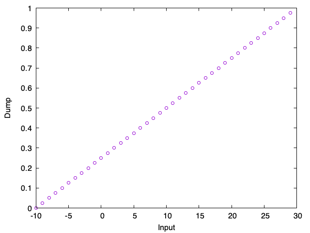

# A Sample File for LAMMPS

This is a sample input file for LAMMPS to check the relation between input and output configuration.

## Usage

```sh
python3 generate_config.py
lmp_serial < test.input
python3 check.py > test.dat
gnuplot test.plt
```

Then, you will have the following `test.png`.



## LISENCE

This software is distributed under the MIT lisence.
